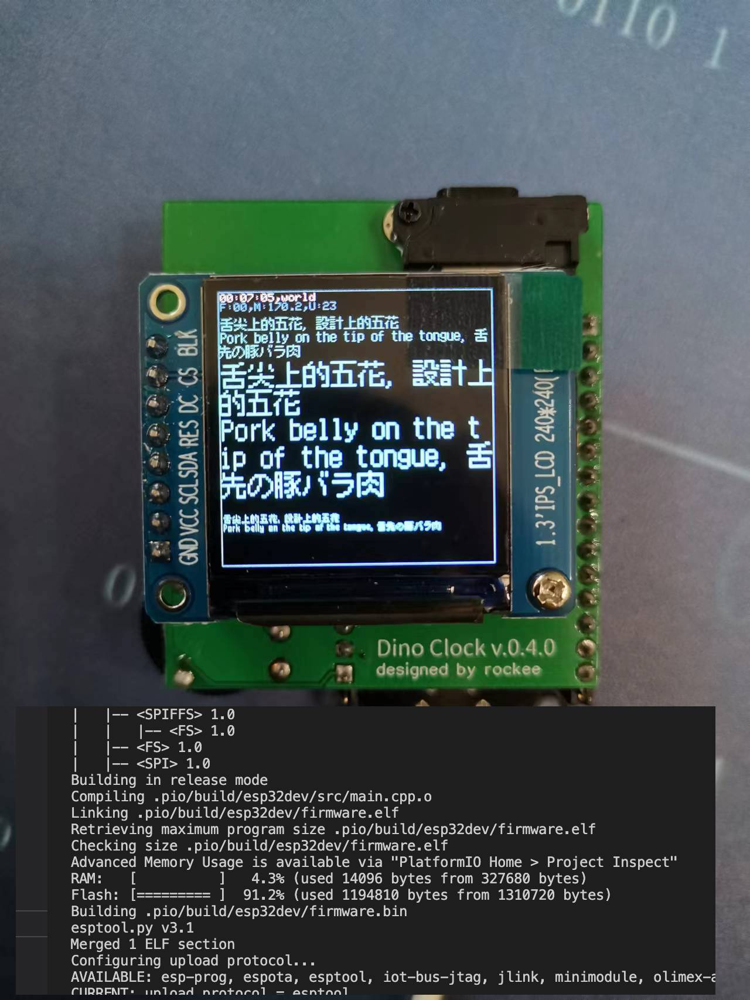

# 支持UTF8的改动说明


### 效果与编译大小1194810 (1.13MB)




### 主要改动
新增一个字体类型 uufont_t，定义位于Fonts/UUFont/uufont.h

```cpp
/* 
  新增一个设置uufont字体的方法，在设置这类字体后。
  TFT_eSprite::printXX系列的将优先使用该字体进行绘制。
  从而实现对utf8的支持，具体修改请看代码部分
*/
void TFT_eSprite::setUUFont(const uufont_t *f = NULL);
```
```cpp
// 伪代码示例
  TFT_eSPI    tft = TFT_eSPI();
  tft.setUUFont(&ZfullGB12pt_12pt); // 12px的字体
  tft.setTextColor(TFT_CYAN);
  tft.setTextSize(1);
  tft.setCursor(2, 32);
  tft.printf("舌尖上的%s, %s", "五花", "設計上的五花");
  tft.setUUFont(NULL);
  sprite->setUUFont(&ZfullGB8pt_8pt); // 8px的字体
  sprite->setTextColor(TFT_CYAN);
  sprite->setTextSize(1);
  sprite->setCursor(2, 100);
  sprite->printf("%s, %s", "Pork belly on the tip of the tongue", "舌先の豚バラ肉");
  sprite->setUUFont(NULL);
```

##### 字体来源
- Fonts/UUFont/Dinkie7_8pt.h  丁卯点阵体试用版 (字体大小 (80.332KB),  glyphs: 2574)
- Fonts/UUFont/Dinkie9_10pt.h 丁卯点阵体试用版 (字体大小 (90.128KB),  glyphs: 2574)
- Fonts/UUFont/zfullgb12pt.h zfull字体 12像素 (字体大小 (582.087KB),  glyphs: 22135, 基本包含绝大部分的中英繁日)
- Fonts/UUFont/zfullgb8pt.h zfull字体 8像素 (字体大小 (353.614KB), glyphs: 21983, 基本包含绝大部分的中英繁日)

#### zfull字体来源
https://github.com/andot/zfull-for-yosemite/blob/master/fonts/Zfull-GB.ttf

### 参考
- https://github.com/noolua/Adafruit-GFX-Library


### 测试代码

```c
#define COLOR_DEPTH 16
#ifdef ST7789_DRIVER
#define IWIDTH  240
#define IHEIGHT 240
#endif

#define BG_CLR  TFT_BLACK
#define TS_FAST   10
#define TS_SLOW   100

#include <TFT_eSPI.h>
#define USE_TFT_eSPI
// #include "zfullgb8pt.h"
// #include "zfullgb12pt.h"

// Library instance
TFT_eSPI    tft = TFT_eSPI();         // Declare object "tft"

TFT_eSprite spr[1] = {TFT_eSprite(&tft)};

// Toggle buffer selection
bool sprSel = 0;

// Pointers to start of Sprites in RAM
uint16_t* sprPtr[2];

// Define the cube face colors
uint16_t palette[] = {TFT_WHITE,  // 1
                      TFT_GREENYELLOW,    // 2
                      TFT_YELLOW, // 3
                      TFT_PINK,  // 4
                      TFT_MAGENTA, // 5
                      TFT_CYAN  // 6
                     };

// Used for fps measuring
uint16_t counter = 0;
long startMillis = millis();
uint16_t interval = 100;

void setup() {

  Serial.begin(115200);

  tft.init();

  tft.fillScreen(BG_CLR);

  spr[0].setColorDepth(COLOR_DEPTH);
  sprPtr[0] = (uint16_t*)spr[0].createSprite(IWIDTH, IHEIGHT);
  startMillis = millis();

}

void loop() {
  static uint32_t ts_next_slow = 0, last_fps = 0;
  uint32_t ms_now = millis();
  TFT_eSprite * sprite = &spr[sprSel];
  tft.startWrite();

  if(ts_next_slow < ms_now){
    ts_next_slow = ms_now + TS_SLOW;
    int32_t hour, min, sec;
    hour = (ms_now / 3600000) % 24;
    min = (ms_now % 3600000) / 60000;
    sec = (ms_now / 1000) % 60;
    sprite->fillSprite(BG_CLR);

    sprite->drawRect(0, 0, IWIDTH, IHEIGHT, TFT_SKYBLUE);
    sprite->setCursor(2, 2);
    sprite->setTextSize(1);
    sprite->setTextColor(TFT_WHITE);
    sprite->printf("%02d:%02d:%02d,world", hour, min, sec);

    sprite->setFreeFont(NULL);
    sprite->setTextColor(TFT_SKYBLUE);
    sprite->setTextSize(1);
    sprite->setCursor(2, 10);
    sprite->printf("F:%02d,M:%0.1f,U:23", last_fps, esp_get_free_heap_size()/1024.0);

    sprite->setUUFont(&ZfullGB12pt_12pt);
    sprite->setTextColor(TFT_CYAN);
    sprite->setTextSize(1);
    sprite->setCursor(2, 32);
    sprite->printf("舌尖上的%s, %s", "五花", "設計上的五花");
    sprite->setUUFont(NULL);

    sprite->setUUFont(&ZfullGB12pt_12pt);
    sprite->setTextColor(TFT_CYAN);
    sprite->setTextSize(1);
    sprite->setCursor(2, 44);
    sprite->printf("%s, %s", "Pork belly on the tip of the tongue", "舌先の豚バラ肉");
    sprite->setUUFont(NULL);

    sprite->setUUFont(&ZfullGB12pt_12pt);
    sprite->setTextColor(TFT_CYAN);
    sprite->setTextSize(2);
    sprite->setCursor(2, 80);
    sprite->printf("舌尖上的%s, %s", "五花", "設計上的五花");
    sprite->setUUFont(NULL);

    sprite->setUUFont(&ZfullGB12pt_12pt);
    sprite->setTextColor(TFT_CYAN);
    sprite->setTextSize(2);
    sprite->setCursor(2, 128);
    sprite->printf("%s, %s", "Pork belly on the tip of the tongue", "舌先の豚バラ肉");
    sprite->setUUFont(NULL);


    sprite->setUUFont(&ZfullGB8pt_8pt);
    sprite->setTextColor(TFT_CYAN);
    sprite->setTextSize(1);
    sprite->setCursor(2, 200);
    sprite->printf("舌尖上的%s, %s", "五花", "設計上的五花");
    sprite->setUUFont(NULL);

    sprite->setUUFont(&ZfullGB8pt_8pt);
    sprite->setTextColor(TFT_CYAN);
    sprite->setTextSize(1);
    sprite->setCursor(2, 208);
    sprite->printf("%s, %s", "Pork belly on the tip of the tongue", "舌先の豚バラ肉");
    sprite->setUUFont(NULL);


    sprite->pushSprite(0, 0); // Blocking write (no DMA) 115fps
  }
  tft.endWrite();

}
```
